# 🏗️ YOLO Traffic Counter - Architecture & Flow Diagram

## 📊 Project Architecture Overview

## 🔄 Data Processing Flow

```mermaid
flowchart LR
    subgraph "📹 Input"
        A[Video Files<br/>MP4/AVI/MOV]
        B[Image Files<br/>JPG/PNG]
    end
    
    subgraph "🔍 Detection Pipeline"
        C[YOLO Detector]
        D[Object Detection]
        E[Bounding Boxes]
    end
    
    subgraph "🎯 Tracking & Counting"
        F[Multi-Object Tracker]
        G[Trajectory Analysis]
        H[Line Crossing Detection]
        I[Count Statistics]
    end
    
    subgraph "📊 Output"
        J[Annotated Video]
        K[Count Results]
        L[Analytics Charts]
        M[JSON Statistics]
    end
    
    A --> C
    B --> C
    C --> D
    D --> E
    E --> F
    F --> G
    G --> H
    H --> I
    I --> J
    I --> K
    I --> L
    I --> M
```

## 🎓 Training Pipeline Flow

## 🌐 Web Interface Architecture

```mermaid
graph TB
    subgraph "🎨 Frontend Components"
        A[Traffic Counting Tab]
        B[Model Training Tab]
        C[Data Management Tab]
        D[Model Management Tab]
    end
    
    subgraph "⚙️ Backend Services"
        E[TrafficCounterApp<br/>src/frontend/app.py]
        F[Video Processing]
        G[Model Training]
        H[Data Conversion]
        I[Model Management]
    end
    
    subgraph "📊 Visualization"
        J[Plotly Charts]
        K[Real-time Statistics]
        L[Progress Tracking]
    end
    
    A --> E
    B --> E
    C --> E
    D --> E
    
    E --> F
    E --> G
    E --> H
    E --> I
    
    F --> J
    G --> K
    H --> L
    I --> L
```

## 🔧 Configuration Management Flow

## 📋 Implementation Checklist

### ✅ Completed Components

#### 🔍 Core Detection System
- [x] **YOLODetector** - Complete YOLO-based object detection
  - Multi-format support (MP4, AVI, MOV, MKV)
  - GPU acceleration with CUDA support
  - Configurable confidence and NMS thresholds
  - Benchmark functionality for performance testing

- [x] **TrafficCounter** - Advanced tracking and counting
  - Multi-object tracking with trajectory analysis
  - Customizable counting lines (horizontal, vertical, diagonal)
  - Line crossing detection algorithm
  - Thread-safe operations with locks

#### 📝 Data Management System
- [x] **ImageAnnotator** - Interactive annotation tool
  - Mouse-based bounding box drawing
  - Multi-class support
  - Real-time annotation preview
  - Save/load existing annotations

- [x] **DataConverter** - Format conversion utilities
  - XML (Pascal VOC) ↔ TXT (YOLO) conversion
  - Batch processing with parallel execution
  - Data validation and error reporting
  - Progress tracking with tqdm

#### 🎓 Training System
- [x] **YOLOTrainer** - Model training pipeline
  - Automated dataset preparation
  - Multiple YOLO model sizes support
  - Training progress monitoring
  - Model export functionality

#### 🌐 Frontend System
- [x] **TrafficCounterApp** - Web interface
  - Modern Gradio-based UI
  - Multi-tab interface design
  - Real-time video processing
  - Interactive analytics with Plotly charts

#### 🔧 Infrastructure
- [x] **ConfigLoader** - Configuration management
  - YAML-based configuration
  - Nested key access with dot notation
  - Dynamic configuration updates
  - Directory auto-creation

- [x] **Logger** - Unified logging system
  - Multi-level logging (DEBUG, INFO, WARNING, ERROR)
  - File and console output
  - Thread-safe logging operations

### 🎯 Key Technical Achievements

#### 🚀 Performance Optimizations
- **Parallel Processing**: Batch operations use ThreadPoolExecutor
- **Memory Efficiency**: Streaming video processing to minimize RAM usage
- **GPU Utilization**: Automatic device detection and optimization
- **Caching**: Smart caching of model weights and configurations

#### 🔒 Robustness Features
- **Error Handling**: Comprehensive try-catch blocks with meaningful error messages
- **Thread Safety**: Locks and thread-safe operations throughout
- **Input Validation**: Robust validation of all inputs and parameters
- **Resource Management**: Proper cleanup of resources and temporary files

#### 🎨 User Experience
- **Intuitive Interface**: Clean, modern web UI with clear navigation
- **Real-time Feedback**: Progress bars and live updates during processing
- **Interactive Visualization**: Dynamic charts and statistics
- **Comprehensive Documentation**: Detailed README and inline documentation

## 🔄 Development Flow Summary

### Phase 1: Foundation ✅
1. **Project Structure Setup** - Created modular architecture
2. **Configuration System** - Implemented YAML-based config management
3. **Logging Infrastructure** - Set up unified logging system
4. **Dependencies Management** - Defined comprehensive requirements

### Phase 2: Core Functionality ✅
1. **YOLO Integration** - Implemented object detection with Ultralytics
2. **Video Processing** - Added multi-format video support
3. **Object Tracking** - Developed multi-object tracking system
4. **Counting Algorithm** - Created line-crossing detection logic

### Phase 3: Data Pipeline ✅
1. **Annotation Tool** - Built interactive GUI for data labeling
2. **Format Conversion** - Implemented XML ↔ YOLO conversion
3. **Data Validation** - Added comprehensive validation system
4. **Dataset Preparation** - Automated training dataset creation

### Phase 4: Training System ✅
1. **Model Training** - Integrated YOLO training pipeline
2. **Performance Monitoring** - Added training progress tracking
3. **Model Management** - Implemented model save/load functionality
4. **Validation System** - Created model validation pipeline

### Phase 5: Frontend Development ✅
1. **Web Interface** - Built modern Gradio-based UI
2. **Real-time Processing** - Implemented live video processing
3. **Analytics Dashboard** - Created interactive charts and statistics
4. **User Experience** - Optimized interface for ease of use

### Phase 6: Integration & Testing ✅
1. **CLI Interface** - Created unified command-line interface
2. **Error Handling** - Implemented comprehensive error management
3. **Performance Optimization** - Added parallel processing and caching
4. **Documentation** - Created extensive documentation and examples

## 🎉 Final Architecture Benefits

### 🏗️ **Modular Design**
- Each component is independent and reusable
- Easy to maintain and extend
- Clear separation of concerns

### ⚡ **High Performance**
- GPU acceleration for inference
- Parallel processing for batch operations
- Memory-efficient video processing
- Optimized algorithms for real-time performance

### 🔒 **Robust & Reliable**
- Comprehensive error handling
- Thread-safe operations
- Input validation and sanitization
- Resource management and cleanup

### 🎨 **User-Friendly**
- Intuitive web interface
- Clear command-line interface
- Real-time feedback and progress tracking
- Interactive visualizations

### 🔧 **Highly Configurable**
- YAML-based configuration system
- Runtime parameter adjustment
- Multiple model size options
- Customizable processing parameters

---

**🚗 This architecture ensures the YOLO Traffic Counter is production-ready with enterprise-grade reliability, performance, and user experience! 🚗**